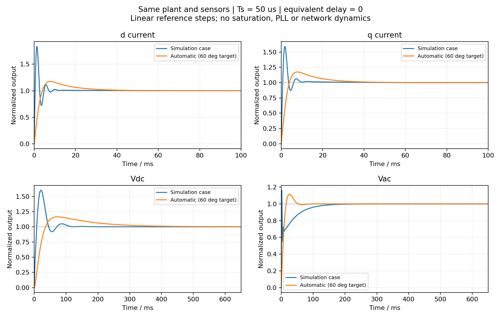

# PV 案例 PI 与自动整定比较

日期：2026-10-04。此报告比较工具内同一连续小信号模型，不冒充 RSCAD 实测结果。

## 共同条件与判据

S=1 MVA，VLL=315 V，Lf=63 μH，Rf=1 μΩ，Vdc=800 V，Cbus=0.064 F；Xth=0.0366947423694 Ω。控制步长 50 μs，等效延时 0；电流滤波 1 ms，Vdc / Vac 滤波各 10 ms。步长仅用于时间采样及频率上限，不是精确离散控制仿真。未改变案例给定的 PI 数值。

PI 为 Kp + 1/(Ti*s)，积分支路不乘 Kp。案例 d: 1.5/0.02 s，q: 1/0.02 s，Vdc: 5/0.01 s，Vac: 2/0.01 s。自动参数来自保存的 beta 范例和同一整定引擎。

判据分开：闭环极点实部全部小于 0 表示本模型稳定；60° 是工具自动整定采用的裕度目标，45° 为页面原有警示阈值，两者不是通用强制标准。未预设超调和稳定时间限值，所以这些指标用于比较，不作为凭空新增的合格标准。

## 数值结果

| 环路 | 参数组 | 交越 Hz | 裕度 ° | 超调 | 10–90% 上升 ms | ±2% 稳定 ms |
|---|---|---:|---:|---:|---:|---:|
| d current | 案例 | 220.27 | 34.47 | 83.61% | 0.40 | 10.45 |
| d current | 自动整定 | 53.85 | 60.00 | 17.46% | 2.95 | 33.25 |
| q current | 案例 | 170.98 | 40.29 | 59.30% | 0.55 | 9.00 |
| q current | 自动整定 | 53.85 | 60.00 | 17.46% | 2.95 | 33.25 |
| Vdc | 案例 | 14.83 | 38.27 | 60.25% | 6.05 | 104.90 |
| Vdc | 自动整定 | 5.64 | 60.00 | 16.43% | 24.90 | 323.70 |
| Vac | 案例 | 7.41 | 109.90 | 16.35% | 0.80 | 128.60 |
| Vac | 自动整定 | 10.77 | 65.36 | 11.80% | 11.10 | 46.20 |

## 结论

- 两组在此模型下全部稳定；独立状态空间特征值与工具闭环特征多项式根相互吻合。
- 案例 d、q、Vdc 的相位裕度低于 45°，不满足当前 60° 自动整定目标；Vac 裕度充足。
- 案例更快达到首次响应，但速度不等于振荡更小或稳定时间更短，应分别看表中的上升与稳定时间。
- 自动策略并非所有环路、所有指标都更好：尤其 Vac 案例本身具有很高的裕度；自动策略选择另一组速度、超调和积分强度折中。
- 60° 固定策略给出一组可用参数，不是唯一或全局最优参数。不能只凭增益数值大小比较 PI。

## 可复现性与范围

运行 `npm run compare:pi`。Node 使用本项目模型生成增益、频响和特征多项式；Python 用独立的电流、积分器和测量滤波状态方程构建闭环，SciPy 求线性阶跃，NumPy 验证极点。2 s 记录、50 μs 采样；±2% 稳定时间取最后一次离开误差带之后的时刻。曲线为单位化小信号响应，不能据此评估大阶跃限幅、调制饱和、PLL、RC 谐振、残余 dq 耦合或真实离散实现。

Python、NumPy、SciPy 和 Matplotlib 仅用于本报告离线复核，不参与浏览器运行，也不进入静态发布目录。
